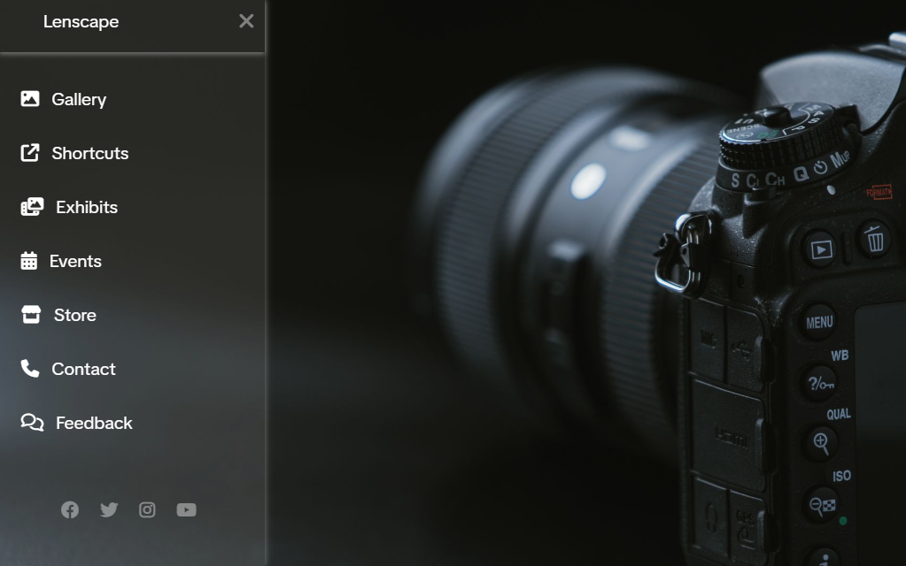

# 📸 Lenscape — Responsive Sidebar Photography Portfolio

A clean and modern **responsive sidebar menu** built using only HTML and CSS. Designed as a minimalist layout for photographers to showcase their work or personal brand.

## 🚀 Features

- 📱 Responsive full-screen sidebar
- 🎛️ Toggle with hamburger & close icon
- 🎨 Frosted glass effect using `rgba` + shadow
- 🧭 Navigation links with Font Awesome icons
- 🌐 Social media icons with hover effects
- 💡 Built using **HTML + CSS only** — no JavaScript

## 🛠️ Built With

- HTML5  
- CSS3  
- [Font Awesome](https://fontawesome.com/) for icons  
- [Google Fonts - Poppins](https://fonts.google.com/specimen/Poppins)  
- [Google Fonts - TikTok Sans](https://fonts.google.com/specimen/TikTok+Sans)

## 📂 Project Structure
📁 project-folder/
├── index.html
├── style.css
└── photo.jpg

## ✨ Usage

1. Clone the repository or download the ZIP.
2. Open `index.html` in your browser.
3. Customize links, icons, or background (`photo.jpg`) as needed.

## 📸 Use Case

Ideal for:
- Photography portfolios  
- Personal landing pages  
- Creative resumes or galleries

## 📝 License

This project is open-source and free to use under the [MIT License](LICENSE).

---

### 🔠 Font Credits

- **Poppins** by Indian Type Foundry — [Google Fonts](https://fonts.google.com/specimen/Poppins)  
- **TikTok Sans** — Available via [Google Fonts](https://fonts.google.com/specimen/TikTok+Sans)

---

**Designed with passion for visual storytellers.**
